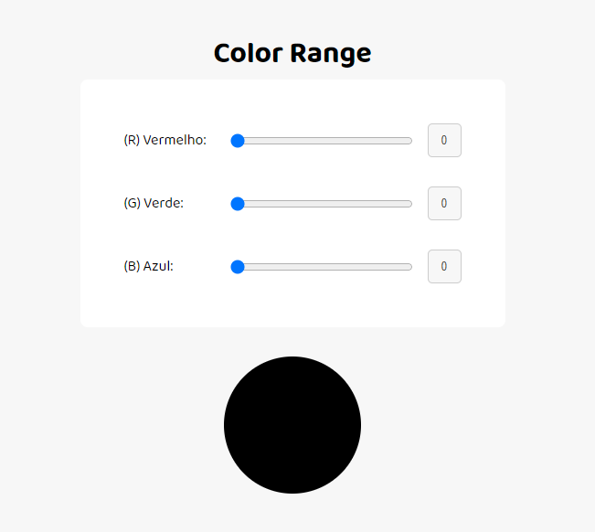

# Color Range com JavaScript

## Trabalho Prático do Módulo 1

Esse foi o trabalho do módulo 1 do bootcamp FullStack do IGTI

## Como usar ?

* Fazer o clone do repositório
* Abrir o **index.html** usando live-server ou outro servidor web

## Realizador do bootcamp
[Instituto de Gestão e Tecnologia](https://www.igti.com.br/)